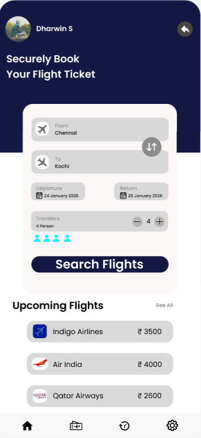
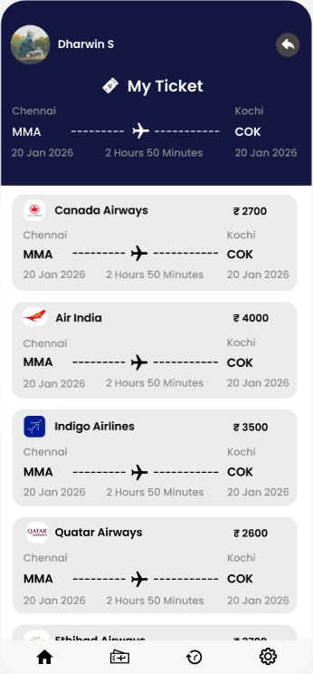
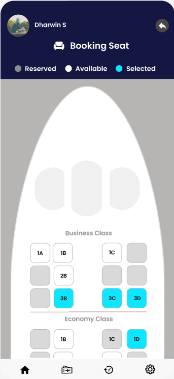
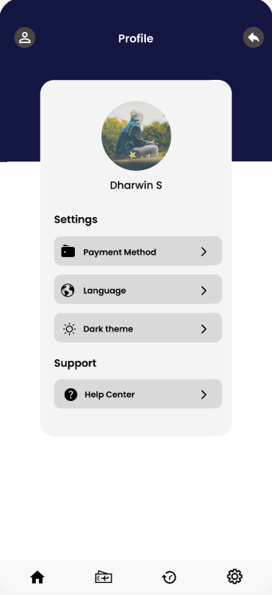

# Flight Ticket Booking System

<div align="center">
  
</div>

<br>

<li><u>Figma Design Prototype:</u> 
<a href="https://www.figma.com/proto/0GKQgwLpPWy4ghfZyPi9pd/Flight-Ticket-Booking?node-id=56-9&t=kuyRJULk0U3ApM9z-1" target="_blank">View Design</a></li>

## Abstract

<p>Flight ticket booking is a crucial component of modern travel planning. With the increasing demand for convenient and user-friendly booking platforms, there is a need for intuitive interfaces that streamline the booking process. This project presents a comprehensive flight ticket booking system designed with a focus on user experience, featuring seamless flight search, comparison, booking, and management capabilities. The design emphasizes clarity, efficiency, and accessibility across all devices.</p>

## Project Overview

<p>This Flight Ticket Booking System is a comprehensive web application that provides users with a complete travel booking experience. The system allows users to search for flights based on origin, destination, and travel dates, compare prices and flight options, select seats, enter passenger details, and complete secure payments. The application is designed with modern UI/UX principles, ensuring an intuitive and pleasant user experience from start to finish.</p>

<p>The design prototype consists of <b>10 comprehensive screens</b> that cover the entire user journey from initial search to booking confirmation.</p>

## UI/UX Design Screens

<p>The application interface has been carefully designed in Figma, covering all essential user flows and interactions. Below are the key screens of the application:</p>

<div align="center">
  <br>
  <b><i>Figure 1<br>Home/Landing Page - Initial flight search interface</i></b>
  <br><br>

  <br>
  <b><i>Figure 2<br>Flight Search Results - List of available flights with filters</i></b>
  <br><br>

  <br>
  <b><i>Figure 3<br>Flight Details - Detailed information about selected flight</i></b>
  <br><br>

  <br>
  <b><i>Figure 4<br>Passenger Information - Form for entering traveler details</i></b>
  <br><br>

  <br>
  <b><i>Figure 5<br>Seat Selection - Interactive seat map interface</i></b>
  <br><br>

  <br>
  <b><i>Figure 6<br>Booking Summary - Review before payment</i></b>
  <br><br>

  <br>
  <b><i>Figure 7<br>Payment Gateway - Secure payment processing</i></b>
  <br><br>

  <br>
  <b><i>Figure 8<br>Booking Confirmation - Success message and ticket details</i></b>
  <br><br>

  <br>
  <b><i>Figure 9<br>User Profile - Account management interface</i></b>
  <br><br>

  <br>
  <b><i>Figure 10<br>Booking History - Past and upcoming bookings</i></b>
  <br><br>
</div>

## Features & Functionality

### Core Features

<ul>
<li><b>🔍 Smart Flight Search:</b> Search flights by origin, destination, departure date, return date, and number of passengers with real-time results</li>

<li><b>📅 Flexible Date Selection:</b> Interactive calendar with date range picker for departure and return flights, showing price variations across dates</li>

<li><b>✈️ Flight Comparison:</b> Compare multiple flight options side-by-side with details on duration, stops, airlines, and pricing</li>

<li><b>🏷️ Advanced Filters:</b> Filter flights by price range, airlines, departure/arrival times, number of stops, and aircraft type</li>

<li><b>👥 Multi-Passenger Management:</b> Add and manage details for multiple passengers including adults, children, and infants</li>

<li><b>💺 Interactive Seat Selection:</b> Visual seat map showing available, occupied, and premium seats with real-time selection</li>

<li><b>💳 Secure Payment Processing:</b> Multiple payment options including credit/debit cards, digital wallets, and UPI with secure encryption</li>

<li><b>📧 Instant Confirmation:</b> Email and SMS notifications with e-tickets, booking reference, and travel itinerary</li>

<li><b>📱 Responsive Design:</b> Fully optimized interface for desktop, tablet, and mobile devices with consistent user experience</li>
</ul>

### Additional Features

<ul>
<li><b>📊 Booking Management:</b> View, modify, or cancel bookings with real-time updates on booking status</li>

<li><b>👤 User Profile:</b> Manage personal information, saved payment methods, and travel preferences</li>

<li><b>🔔 Flight Notifications:</b> Real-time alerts for flight status changes, gate changes, and boarding reminders</li>

<li><b>⭐ Saved Searches:</b> Save frequent routes and get price alerts when fares drop</li>

<li><b>🎫 Digital Boarding Pass:</b> Generate and download digital boarding passes</li>

<li><b>💰 Price Tracking:</b> Monitor flight prices and receive notifications when prices change</li>

<li><b>🌍 Multi-Currency Support:</b> Display prices in different currencies based on user preference</li>

<li><b>🔐 Secure Authentication:</b> User login/signup with email verification and password recovery</li>
</ul>

## Technologies & Tools

### Design & Prototyping

<ul>
<li><b>Figma</b> - Primary UI/UX design and prototyping tool</li>
<li><b>Adobe Illustrator</b> - Vector graphics and icon design</li>
<li><b>Adobe Photoshop</b> - Image editing and optimization</li>
</ul>

### Frontend Technologies (Proposed)

<ul>
<li><b>HTML5</b> - Semantic markup and structure</li>
<li><b>CSS3</b> - Styling, animations, and responsive design</li>
<li><b>JavaScript (ES6+)</b> - Interactive functionality and dynamic content</li>
<li><b>React.js / Vue.js / Angular</b> - Modern frontend framework for component-based architecture</li>
<li><b>Bootstrap / Tailwind CSS</b> - CSS framework for rapid development</li>
</ul>

### Backend Technologies (Proposed)

<ul>
<li><b>Node.js + Express</b> - Server-side JavaScript runtime and framework</li>
<li><b>Python + Django/Flask</b> - Alternative backend framework</li>
<li><b>RESTful API</b> - API architecture for client-server communication</li>
<li><b>JWT</b> - JSON Web Tokens for secure authentication</li>
</ul>

### Database (Proposed)

<ul>
<li><b>MongoDB</b> - NoSQL database for flexible data storage</li>
<li><b>PostgreSQL</b> - Relational database for structured data</li>
<li><b>Redis</b> - In-memory cache for session management</li>
</ul>

### Third-Party Integrations (Proposed)

<ul>
<li><b>Flight APIs</b> - Amadeus, Skyscanner, or Travelport for flight data</li>
<li><b>Payment Gateways</b> - Stripe, PayPal, Razorpay for payment processing</li>
<li><b>Email Service</b> - SendGrid or AWS SES for email notifications</li>
<li><b>SMS Service</b> - Twilio for SMS notifications</li>
</ul>

## User Journey & Flow

<p>The application follows a logical and intuitive user flow designed to minimize friction and maximize conversion:</p>

<ol>
<li><b>Landing Page:</b> User arrives at the homepage and enters search criteria (origin, destination, dates, passengers)</li>

<li><b>Search Results:</b> System displays available flights with relevant filters and sorting options</li>

<li><b>Flight Selection:</b> User selects a flight and views detailed information including baggage allowance, amenities, and cancellation policy</li>

<li><b>Passenger Details:</b> User enters required information for all passengers including names, contact details, and special requests</li>

<li><b>Seat Selection:</b> User selects preferred seats from an interactive seat map (optional, may incur additional charges)</li>

<li><b>Add-ons & Services:</b> User can add extras like baggage, meals, travel insurance, and airport lounge access</li>

<li><b>Review & Confirmation:</b> User reviews complete booking summary including all charges and terms</li>

<li><b>Payment:</b> User selects payment method and completes secure transaction</li>

<li><b>Booking Confirmation:</b> System generates booking reference, sends confirmation email/SMS with e-ticket</li>

<li><b>Post-Booking:</b> User can manage booking, check-in online, download boarding pass, and track flight status</li>
</ol>

## Design System

### Color Palette

<ul>
<li><b>Primary Color:</b> #2563EB (Blue) - Trust, reliability, professionalism</li>
<li><b>Secondary Color:</b> #10B981 (Green) - Success, confirmation, positive actions</li>
<li><b>Accent Color:</b> #F59E0B (Amber) - Highlights, promotions, call-to-action</li>
<li><b>Background:</b> #F9FAFB (Light Gray) - Clean, minimal background</li>
<li><b>Text Primary:</b> #111827 (Dark Gray) - Main content text</li>
<li><b>Text Secondary:</b> #6B7280 (Medium Gray) - Supporting text</li>
<li><b>Error:</b> #EF4444 (Red) - Errors, warnings, cancellations</li>
</ul>

### Typography

<ul>
<li><b>Primary Font:</b> Inter, System UI, Sans-serif</li>
<li><b>Heading 1:</b> 36px, Bold (700)</li>
<li><b>Heading 2:</b> 28px, Semibold (600)</li>
<li><b>Heading 3:</b> 22px, Semibold (600)</li>
<li><b>Body Text:</b> 16px, Regular (400)</li>
<li><b>Small Text:</b> 14px, Regular (400)</li>
<li><b>Button Text:</b> 16px, Medium (500)</li>
</ul>

### UI Components

<ul>
<li><b>Buttons:</b> Primary, Secondary, Outline, Text, Icon buttons with hover and active states</li>
<li><b>Input Fields:</b> Text inputs, dropdowns, date pickers, number steppers with validation states</li>
<li><b>Cards:</b> Flight cards, booking cards, info cards with shadows and hover effects</li>
<li><b>Navigation:</b> Top navigation bar with logo, menu items, user profile, and mobile hamburger menu</li>
<li><b>Modals:</b> Overlay dialogs for confirmations, filters, and additional information</li>
<li><b>Alerts:</b> Success, error, warning, and info notifications</li>
<li><b>Progress Indicators:</b> Multi-step progress bar for booking flow</li>
<li><b>Loading States:</b> Spinners and skeleton screens for async operations</li>
</ul>

## Target Audience

<ul>
<li><b>Leisure Travelers:</b> Individuals and families planning vacations and personal trips</li>
<li><b>Business Travelers:</b> Corporate professionals requiring frequent business travel arrangements</li>
<li><b>Travel Agencies:</b> Professional travel agents booking on behalf of clients</li>
<li><b>International Students:</b> Students traveling for education or returning home</li>
<li><b>Senior Citizens:</b> Older adults who prefer straightforward, easy-to-use interfaces</li>
<li><b>Last-Minute Bookers:</b> Users looking for immediate travel solutions</li>
</ul>

## Key Design Principles

<ul>
<li><b>Simplicity:</b> Clean, uncluttered interface with clear information hierarchy</li>
<li><b>Consistency:</b> Uniform design patterns and interactions throughout the application</li>
<li><b>Accessibility:</b> WCAG 2.1 compliant design ensuring usability for all users</li>
<li><b>Transparency:</b> Clear pricing with no hidden fees, all charges displayed upfront</li>
<li><b>Trust:</b> Security badges, SSL certificates, and customer reviews to build confidence</li>
<li><b>Speed:</b> Fast loading times and optimized performance for quick bookings</li>
<li><b>Mobile-First:</b> Designed primarily for mobile devices, enhanced for desktop</li>
</ul>

## Getting Started

### Prerequisites

```bash
# For viewing the design
- Figma account (free)
- Modern web browser (Chrome, Firefox, Safari, Edge)

# For implementation (when developing)
- Node.js >= 14.x
- npm >= 6.x or yarn >= 1.22
- Git
```

### Viewing the Design

<p>1. Access the Figma prototype:</p>

```bash
Visit: https://www.figma.com/proto/0GKQgwLpPWy4ghfZyPi9pd/Flight-Ticket-Booking?node-id=56-9&t=kuyRJULk0U3ApM9z-1
```

<p>2. Navigate through screens using the prototype navigation</p>

<p>3. Inspect design elements, measurements, and styles in the Figma editor</p>

### Implementation Setup (Future)

<p>1. Clone the repository:</p>

```bash
git clone https://github.com/[your-username]/Flight-Ticket-Booking.git
cd Flight-Ticket-Booking
```

<p>2. Install dependencies:</p>

```bash
npm install
# or
yarn install
```

<p>3. Set up environment variables:</p>

```bash
cp .env.example .env
# Edit .env with your API keys and configuration
```

<p>4. Run development server:</p>

```bash
npm run dev
# or
yarn dev
```

<p>5. Open browser and navigate to `http://localhost:3000`</p>

## Project Structure (Proposed)

```
Flight-Ticket-Booking/
│
├── public/                    # Static assets
│   ├── images/               # Image files
│   │   ├── image1.png        # Landing page
│   │   ├── image2.png        # Search results
│   │   ├── image3.png        # Flight details
│   │   ├── image4.png        # Passenger info
│   │   ├── image5.png        # Seat selection
│   │   ├── image6.png        # Booking summary
│   │   ├── image7.png        # Payment
│   │   ├── image8.png        # Confirmation
│   │   ├── image9.png        # User profile
│   │   └── image10.png       # Booking history
│   ├── icons/                # Icon assets
│   └── fonts/                # Custom fonts
│
├── src/                       # Source code
│   ├── components/           # Reusable UI components
│   │   ├── common/          # Common components
│   │   ├── flight/          # Flight-related components
│   │   ├── booking/         # Booking flow components
│   │   └── user/            # User-related components
│   │
│   ├── pages/               # Page components
│   │   ├── Home.jsx         # Landing page
│   │   ├── SearchResults.jsx
│   │   ├── FlightDetails.jsx
│   │   ├── Booking.jsx
│   │   ├── Payment.jsx
│   │   ├── Confirmation.jsx
│   │   ├── Profile.jsx
│   │   └── History.jsx
│   │
│   ├── services/            # API services
│   │   ├── flightApi.js
│   │   ├── bookingApi.js
│   │   └── paymentApi.js
│   │
│   ├── utils/               # Utility functions
│   ├── hooks/               # Custom React hooks
│   ├── context/             # React Context
│   ├── styles/              # Global styles
│   └── App.jsx              # Main app component
│
├── server/                   # Backend code (if applicable)
│   ├── routes/
│   ├── controllers/
│   ├── models/
│   └── middleware/
│
├── .env.example             # Environment variables template
├── package.json             # Dependencies
├── README.md               # Project documentation
└── LICENSE                 # License file
```

## Future Enhancements

<ul>
<li>☐ <b>Multi-City Bookings:</b> Support for complex itineraries with multiple destinations</li>
<li>☐ <b>Hotel Integration:</b> Bundle flights with hotel bookings for complete travel packages</li>
<li>☐ <b>Car Rental:</b> Add car rental options at destination airports</li>
<li>☐ <b>Travel Insurance:</b> Integrated travel insurance options with multiple coverage levels</li>
<li>☐ <b>Loyalty Program:</b> Rewards points system for frequent travelers</li>
<li>☐ <b>Group Bookings:</b> Special features for booking 10+ passengers</li>
<li>☐ <b>Price Prediction:</b> AI-powered price forecasting to suggest best booking times</li>
<li>☐ <b>Virtual Assistant:</b> Chatbot for customer support and booking assistance</li>
<li>☐ <b>Social Sharing:</b> Share travel plans with friends and family</li>
<li>☐ <b>Offline Mode:</b> Access boarding passes and booking details offline</li>
<li>☐ <b>Voice Search:</b> Voice-activated flight search and booking</li>
<li>☐ <b>AR Features:</b> Augmented reality for airport navigation</li>
<li>☐ <b>Multi-Language:</b> Support for 20+ languages</li>
<li>☐ <b>Accessibility:</b> Enhanced features for users with disabilities</li>
</ul>

## Design Deliverables

<ul>
<li>✅ High-fidelity UI mockups for all 10 screens</li>
<li>✅ Interactive Figma prototype with navigation flows</li>
<li>✅ Responsive design variations (Desktop, Tablet, Mobile)</li>
<li>✅ Component library with reusable UI elements</li>
<li>✅ Design system documentation</li>
<li>✅ Color palette and typography specifications</li>
<li>✅ Icon set and imagery guidelines</li>
</ul>

## Contributing

<p>Contributions to improve the design or implementation are welcome! Please follow these steps:</p>

<ol>
<li>Fork the repository</li>
<li>Create your feature branch (<code>git checkout -b feature/AmazingFeature</code>)</li>
<li>Commit your changes (<code>git commit -m 'Add some AmazingFeature'</code>)</li>
<li>Push to the branch (<code>git push origin feature/AmazingFeature</code>)</li>
<li>Open a Pull Request</li>
</ol>

## License

<p>This project is licensed under the MIT License - see the <a href="LICENSE">LICENSE</a> file for details.</p>

## Contact

<p>For questions, feedback, or collaboration opportunities:</p>

- Email: [dharwinsangamani@gmail.com]
- GitHub: [@Dharwin77](https://github.com/Dharwin77)
- LinkedIn: [Dharwin S](https://linkedin.com/in/dharwin-s)

## Acknowledgments

<ul>
<li>Figma community for design inspiration and resources</li>
<li>Flight booking platforms for UX research and best practices</li>
<li>Open-source community for tools and libraries</li>
<li>Users who provided feedback during the design process</li>
</ul>

---

<div align="center">
  <b>Made with ❤️ using Figma</b>
  <br><br>
  <p><i>This is a UI/UX design prototype. Implementation is in progress.</i></p>
  <br>
  <a href="#flight-ticket-booking-system">⬆ Back to Top</a>
</div>

